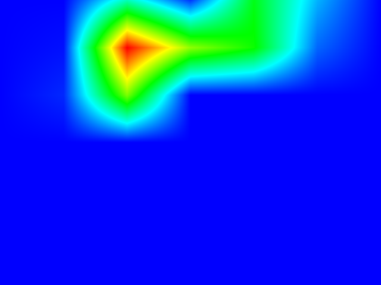
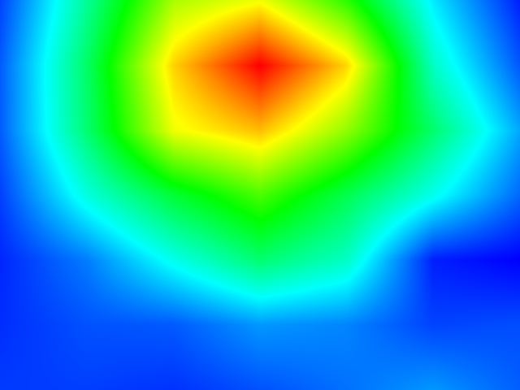

# Grad-CAM for GoogLenet and ResNet
Implementation of [grad-cam](https://arxiv.org/abs/1610.02391) for GoogLenet and ResNet architechtures

### Setup
* Fullfill dependencies as required by the [author's repository](https://github.com/ramprs/grad-cam)
* Clone the repository
  * ```git clone --recursive https://github.com/utsavgarg/gradcam-googlenet-resnet.git```
* For ResNet-101, download model from [here](https://d2j0dndfm35trm.cloudfront.net/resnet-101.t7) and place it in ```fb.resnet.torch``` directory
* Change two path to the following, in ```inception.torch/googlenet.lua```
  * ```local w = paths.concat('inception.torch/' .. f, m.gname .. '_w.h5')```
  * ```local b = paths.concat('inception.torch/' .. f, m.gname .. '_b.h5')```

### Run
* For GoogLenet
  * ```th gcam_googleNet.lua```
* For ResNet 101
  * ```th gcam_resNet.lua```
  
### Sample




* (LTR) Input, GoogLeNet, ResNet


### About
* This repository is a minor modification over the code provided by authors [here](https://github.com/ramprs/grad-cam) to add support for GoogLenet and ResNet-101 architectures, and most files are modifications over the original code provided.
* GoogLenet architecture and weights taken from [here](https://github.com/soumith/inception.torch.git)
* ResNet-101 model and image preprocessing are from [here](https://github.com/facebook/fb.resnet.torch)

### Licence
BSD


